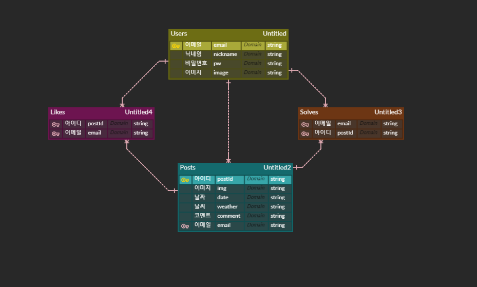

# To-Scribble
> Today, Tomorrow + Scribble의 합성어로서,  
항해 중에 느낀 감정을 그림이나 낙서, 짧은 글로 표현해  
 여러 사용자들과 공감할 수 있는 사이트😉  
> 다른 사람이 그린 그림으로 어떤 기분일지 맞춰보는 퀴즈도 있답니다!  

주소: http://tiwlsj.shop/  
시연 영상: https://www.youtube.com/watch?v=0KSCxgllnyo

## 제작기간 및 팀원소개  
* 2021년 9월 13일 ~ 9월 17일
* 김동우: 그림그리기 기능, 포스팅API, 퀴즈API 프론트엔드  
* 오대수: 로그인, 회원가입, 로그아웃, jwt인증  
* 이승준: 좋아요, 프로필 파일업로드, 포스트 뷰, 퀴즈API 백엔드  
* 이아영: 포스팅 삭제, 마이페이지 회원정보 불러오기, 전체적인 CSS 수정

## 설계

 ### 1. 와이어 프레임
 첨부된 pdf파일 참조  
 메인페이지를 기준으로 로그인, 회원가입, 마이페이지 총 4페이지 기준이며, 기능 및 흐름 표현

 ### 2. 필요 API
 |기능|Method|URL|Request|Response|
|------|---|---|---|---|
|로그인|POST|/api/userlogin/|{"email": user["email"]"password": user["password"],}|{"response": "success"}
|회원가입|POST|/api/usersignup/|{"nickname": user["nickname"],"email": user["email"],"password": user["password"],"passwordCheck": user["passwordCheck"],}|{"response": "success"}
|그림 포스팅|POST|/mainpage/post|{"id": uuid.uuid.hex(),"post_id": uuid.uuid.hex(),"image": user["image"],"date": user["date"],"weather": user["weather"],"comment": user["comment"],"like": 0}|{"response": "success"}
|포스팅 삭제|GET|/mypage/delete|{"post_id": postId,}|{"response": "success"}
|퀴즈 가져오기|GET|/getquiz|필요한 정보 변수에저장|{'msg': "AllSolve"}, {'msg' : "GET",'quiz': ret[random.randrange(0, len(ret))]}
|채점 및 점수 올리기|POST|/solve| |{"result": "success"}

### 3. DB 구성
  

## 사용 기술
* Front-end  
  * Javascript
  * Jquery
  * Bulma
* Back-end
  * Python3
  * Flask
  * MongoDB
* Deploy
  * AWS
 
## 핵심기능
* 로그인, 회원가입
  * 회원가입 시 passlib을 이용한 비밀번호 암호화
  * 로그인 시 JWT를 이용한 인증기능 구현 (권한 없을 시 url로 마이페이지 접근 불가)
  
* 그림 그리기 기능
  * html canvas를 이용하여 사용자가 그림을 그리고, 그것을 파일에 저장하여 활용

* 퀴즈 기능
  * DB를 활용하여 퀴즈 버튼을 누를 때마다 내가 푼 일기, 내가 작성한 일기를 제외하고 랜덤한 그림이 보이도록 함

